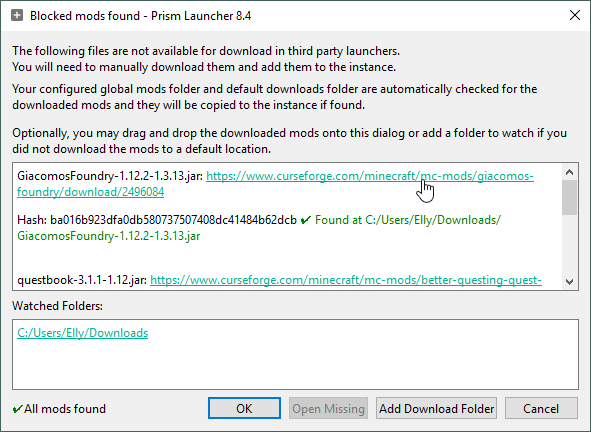

# Installation guide

## CurseForge app

1. Download & launch the [CurseForge app](https://www.curseforge.com/download/app).
2. In the left sidebar, select "Add a Game".
3. Log in & add Minecraft.
4. Browse modpacks in the "Browse" tab after game installation.
5. Search for "Crumbs" and add the modpack as an instance.
6. Adjust settings as recommended below.

## Prism Launcher

1. Download & launch the [Prism Launcher](https://prismlauncher.org/download/) app.
2. Select "Add Instance".
3. From the sources list, select "CurseForge".
4. Search for "Crumbs" and add the modpack as an instance.
5. Adjust settings as recommended below.

A dialog may appear during modpack installation warning that certain mods couldn't be downloaded from CurseForge. Follow the links in the dialog -- optionally setting up a backup mod JAR folder -- and it should resolve the missing mods as you download them.

## Recommended settings

* Minimum memory allocation: 1024 MiB
* Maximum memory allocation: 8592-12288 MiB (based on your system)
